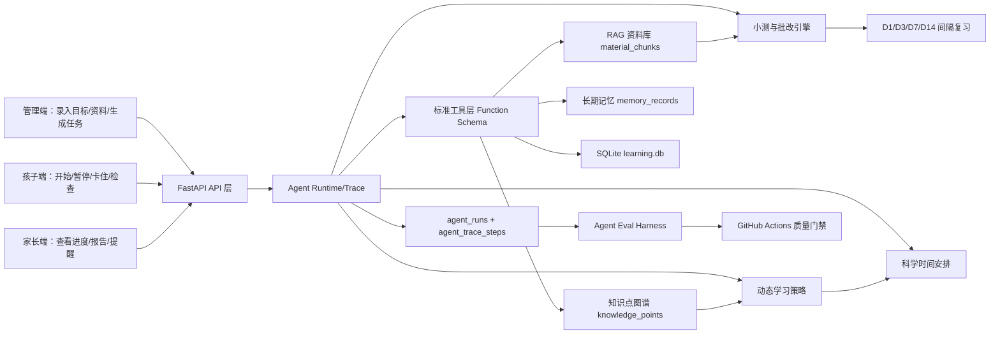
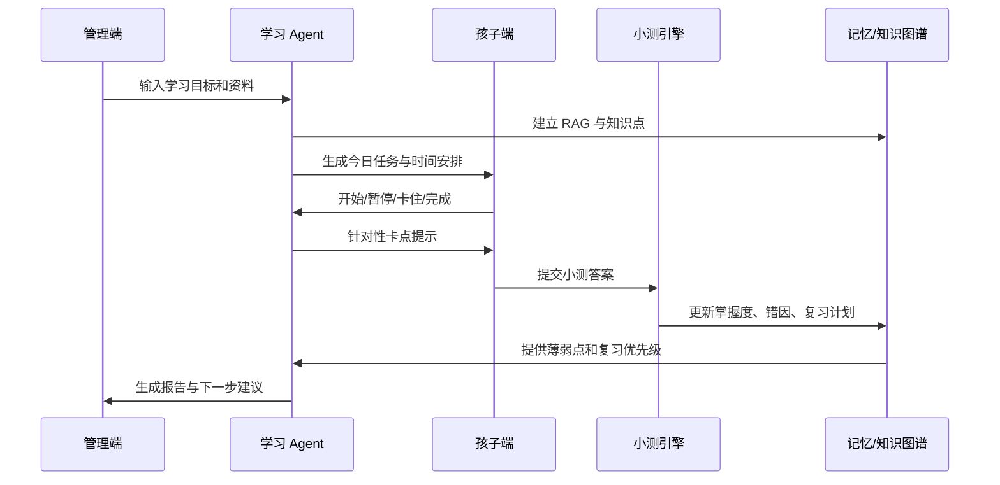

# 学习 Agent 架构图

## 目标定位

本项目是“手控自主学习 Agent”：孩子和家长保留关键决策权，Agent 负责把目标拆成任务、把任务落到时间表、在学习中提供卡点辅导、在学习后生成小测与复习计划。核心目标是服务五年级上册语文、数学、英语暑假预习，并围绕“考试 95 分以上”做结果导向闭环。

## 总体架构

## 关键模块

- `backend/agent.py`：事件触发的 Agent 编排入口，覆盖计划、任务、卡住、出题、批改、报告。
- `backend/agent_runtime.py`：显式运行时封装，生成 `trace_id` 并记录运行阶段。
- `backend/agent_tool_registry.py`：工具 Schema 注册表，描述工具输入、输出和安全级别。
- `backend/knowledge_graph.py`：从 RAG chunk 生成结构化知识点，用于薄弱点和动态策略。
- `backend/learning_strategy.py`：结合薄弱点、复习项、任务负载生成每日策略建议。
- `backend/study_schedule.py`：按注意力规律安排上午/下午/傍晚任务块。
- `eval_harness/`：可复用 Agent 测评项目，既能测学习 Agent，也能测 Demo Tool Agent。

## 数据闭环

## 为什么不是完全放任式 Agent

完全自主 Agent 会更像“自己决定目标、自己改计划、自己执行工具”。本项目面对 11 岁孩子学习场景，目标是稳定、可控、可解释，所以采用“受控自主”：

- 目标由家长设定，Agent 不擅自改变升学目标。
- 资料来源由家长或公开资料导入，Agent 不绕过版权或登录限制。
- 任务可自动生成，但孩子端每一步都有明确按钮和状态。
- AI 可参与计划/辅导/出题，但规则兜底保证无 AI 时也可运行。
- 所有关键 Agent 行为进入 `agent_trace_steps`，便于测评和复盘。
