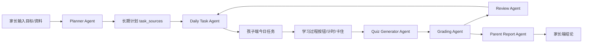

# 学习陪跑 Agent 内核升级方案

## 1. 目标

本方案目标不是继续堆页面，而是把系统从“任务管理工具”升级为“真正能陪孩子学的 Agent”。

最终效果：

- 家长只需要输入学习目标和资料，例如“语文书每日一篇课文、英语 Unit 1 每天一小节、数学每日一节”。
- Agent 自动判断今天该学什么、怎么学、怎么练、怎么测、错了怎么补。
- 孩子端不只是点按钮，而是获得学习步骤、计时、卡住辅导、小测、订正和补漏。
- 家长端不只是看列表，而是看到结论、风险、明天安排和是否需要介入。
- AI 在计划、任务、卡住、出题、批改、诊断、补漏、报告各环节都参与；AI 不通时本地规则兜底，但页面和日志必须明确标识来源。

## 2. 当前状态判断

当前系统已有：

- 管理端自然语言生成计划。
- 孩子端今日任务、开始/暂停/完成/卡住按钮。
- 家长端任务状态、日报、周报。
- 基础题库生成、批改、补漏队列。
- 武汉小学五年级上册语数英基础知识范围。
- OpenAI-compatible AI 接入框架。

当前不足：

- 语文听写、英语默写、数学竖式/错因诊断不够强。
- 小测题型不够细，仍偏通用问答。
- AI 还没有贯穿每个环节。
- 批改主要判断对错，错因分类和明日补漏还不够智能。
- 家长端结论还不够像老师。
- 当前 `.env` 检查结果：`OPENAI_API_KEY` 已存在，但系统配置里 `AI_ENABLED` 未启用，AI 检查返回 `disabled_or_missing_key`。实施前需要确保 `.env` 或管理端配置启用 AI。

## 3. 总体架构

升级后 Agent 分 8 个核心模块：

1. `Planner Agent`：根据家长目标、教材范围、孩子历史表现生成长期学习路径。
2. `Daily Task Agent`：每天决定新课、复习、补漏的比例。
3. `Learning Guide Agent`：把每个任务拆成“怎么学、怎么练、怎么检查”。
4. `Stuck Assist Agent`：孩子卡住时按问题类型即时辅导。
5. `Quiz Generator Agent`：按学科和知识点生成小测。
6. `Grading Agent`：批改并判断错因。
7. `Review Agent`：根据错因生成间隔复习和同类变式。
8. `Parent Report Agent`：给家长生成一句话结论、风险和明日建议。

数据流：

## 4. 学科测验内核设计

### 4.1 语文

语文必须覆盖“字、词、句、段、篇、表达”。

题型：

- `chinese_pinyin`：给生字写拼音。
- `chinese_word_dictation`：听写词语，家长读，孩子输入。
- `chinese_char_group`：生字组词。
- `chinese_word_explain`：解释词语意思。
- `chinese_sentence_understand`：理解关键句。
- `chinese_summary`：概括主要内容。
- `chinese_expression`：仿写或短表达。

例子：

- 听写：请家长读 `白鹭`，孩子输入听写结果。
- 拼音：`鹭` 的读音是什么？
- 组词：用 `鹭` 组一个词。
- 理解：为什么说“白鹭是一首精巧的诗”？
- 表达：仿写一句描写动物外形的句子。

批改规则：

- 听写题必须严格匹配汉字。
- 拼音忽略声调格式差异可宽松判断。
- 理解题由 AI 判断是否抓住关键词。
- 错字进入 `错字本`，第二天优先听写。

### 4.2 英语

英语必须覆盖“听、说、读、写、译”。

题型：

- `english_word_cn_to_en`：中文写英文。
- `english_word_en_to_cn`：英文写中文。
- `english_spelling`：单词默写。
- `english_sentence_fill`：句型填空。
- `english_translation`：中译英/英译中。
- `english_reading_check`：课文信息理解。
- `english_sentence_make`：用重点句型造句。

例子：

- 中译英：学校 → `school`
- 英译中：`library` → `图书馆`
- 填空：`There ___ a library.`
- 造句：用 `My school is ...` 写一句话。
- 课文理解：Unit 1 主要介绍什么？

批改规则：

- 单词拼写忽略大小写，但不忽略漏字母。
- 句型题允许少量标点差异。
- 开放表达由 AI 判断语义是否基本正确。
- 错词进入 `错词本`，按第 1/3/7 天复默。

### 4.3 数学

数学必须覆盖“会算、会讲、会用”。

题型：

- `math_exact`：精确计算。
- `math_vertical_check`：竖式/步骤检查。
- `math_concept_choice`：概念判断。
- `math_step_explain`：说明计算步骤。
- `math_word_problem`：简单应用题。
- `math_error_reason`：判断错因。
- `math_variant`：同类变式题。

例子：

- 计算：`2.4 × 3 = ?`
- 解释：为什么结果是一位小数？
- 判断：`0.8 × 6 = 48` 对吗？
- 应用：每支笔 2.4 元，买 3 支多少钱？
- 错因：这道题错在计算、审题，还是小数点？

批改规则：

- 计算题用数值等价判断。
- 步骤题由 AI 判断是否说清关键步骤。
- 应用题同时检查列式和答案。
- 错因分为：计算错、小数点错、概念错、审题错、单位错。

## 5. 卡住辅导设计

孩子点击 `我卡住了` 后，Agent 先识别问题类型：

- `unknown_char`：不认识字。
- `unknown_word`：不懂词语。
- `unknown_english_word`：不会读/不会拼英文。
- `unclear_requirement`：不懂任务要求。
- `math_first_step`：数学不知道第一步。
- `math_calculation`：会列式但算错。
- `expression_block`：不知道怎么写句子。
- `emotion_resistance`：不想做、烦、累。

不同类型处理：

- 不认识字：给读音、意思、偏旁记法、组词、放回原句。
- 不懂题目：把任务要求拆成动词和产出物。
- 数学不会第一步：先找已知条件和问题，再给一个更小数字的例子。
- 英语不会读：给音节拆分、中文意思、同类词。
- 不想做：缩小任务，先做 3 分钟，保留进度。

验收标准：

- 只影响当前任务，不影响其他任务。
- 右侧显示当前任务标题和孩子原话。
- 有具体下一步，不只是安慰。
- 写入补漏项，家长端能看到。

## 6. 批改与错因诊断

每次小测提交后生成：

- `score`：分数。
- `status`：通过/需订正。
- `wrong_items`：错题列表。
- `error_type`：错因类型。
- `mastery_level`：A/B/C/D。
- `next_action`：下一步动作。
- `review_schedule`：复习计划。
- `parent_note`：给家长一句话。

错因分类：

- 语文：错字、拼音错、词义不懂、课文定位失败、表达不完整。
- 英语：拼写错、词义错、句型错、语序错、表达不完整。
- 数学：计算错、小数点错、概念错、审题错、单位错、步骤不清。

## 7. 动态补漏和间隔复习

补漏不应只是“明天再做一次”，要有节奏：

- 第 1 天：错题/错字/错词立即复测。
- 第 3 天：同类变式复测。
- 第 7 天：混合复测。
- 连续 2 次通过后移出补漏。

补漏任务优先级：

- P0：昨天小测未通过、卡住未解决。
- P1：新课预习。
- P2：拓展/阅读/口语。

每日任务生成规则：

- 如果昨天 P0 未通过，今天先补漏。
- 如果补漏超过 30 分钟，减少新课。
- 如果连续 3 天通过率高于 90%，可适当增加难度。
- 如果连续卡住，家长端提醒介入。

## 8. 家长端智能结论

家长端要从“状态列表”升级为“老师结论”。

日报必须包含：

- 今天完成情况。
- 通过/未通过的知识点。
- 具体错因。
- 明天第一步。
- 家长是否需要介入。
- 如果只陪 10 分钟，陪哪一项。

例子：

> 今天语文《白鹭》预习完成，但 `鹭` 的读音和词语听写不稳。明天先听写 `白鹭、精巧、适宜`，通过后再继续新课。家长只需听写 5 分钟。

## 9. AI 使用策略

AI 必须参与：

- 解析家长目标。
- 从教材范围生成学习路径。
- 根据当天任务生成测验。
- 批改开放题。
- 诊断错因。
- 生成补漏任务。
- 卡住即时辅导。
- 家长日报总结。

AI 不应该做：

- 超出五年级上册范围。
- 直接替孩子完成作业。
- 给竞赛题或初中知识。
- 在没资料依据时胡编课文内容。

必须有本地兜底：

- AI 不通时仍能生成基础任务和基础题。
- 页面和日志必须显示 `AI` 或 `rule` 来源。
- AI 失败不能导致孩子端不可用。

## 10. 数据模型升级

需要新增或扩展：

- `quiz_items.question_type` 支持新题型。
- `quiz_results` 增加 `score_json`、`error_types_json`、`mastery_json`。
- `review_items` 增加 `review_stage`、`attempt_count`、`last_result`。
- `mastery_records` 细化到学科知识点。
- `task_progress` 记录计时、暂停、卡住原因。
- `agent_runs` 记录 AI 使用来源、模型、失败原因。

## 11. 分阶段实施

### 阶段一：测验内核

目标：

- 语文支持听写、拼音、组词、课文理解。
- 英语支持单词默写、中译英、句型填空。
- 数学支持精确计算、概念判断、步骤说明。

验收：

- 三科各生成不少于 5 种题型。
- 不同题型能正确渲染、提交、批改。
- AI 不通时本地规则仍可生成。

### 阶段二：AI 批改和错因诊断

目标：

- 计算题本地精确批改。
- 听写/默写本地严格批改。
- 开放表达题 AI 批改。
- 输出错因和掌握度。

验收：

- 错字进入错字本。
- 错词进入错词本。
- 数学错因能区分计算/小数点/概念/审题。

### 阶段三：动态补漏

目标：

- 根据错因自动生成明日补漏。
- 建立第 1/3/7 天复习节奏。
- 连续通过才移出补漏。

验收：

- 小测低于 80% 时，第二天 P0 自动是补漏。
- 同类变式能生成。
- 家长端能看到补漏原因。

### 阶段四：家长端智能结论

目标：

- 日报从列表变成结论。
- 给出家长介入建议。
- 给出明天第一步。

验收：

- 日报包含完成情况、错因、明日安排、家长建议。
- 周报总结趋势。

### 阶段五：资料增强

目标：

- 接入课本 PDF、单词表、听写资料、音频清单。
- 让任务和测验基于资料生成。

验收：

- 上传/录入资料后，任务能引用资料范围。
- 英语 Unit 的单词默写来自资料。
- 语文生字词来自课文/资料。

## 12. 最终评分目标

当前评分：

- 框架：7/10
- Agent 内核：4.5/10
- 学科专业度：5/10
- AI 参与度：3/10
- 总分：5.5/10

完成本方案后目标：

- 框架：8.5/10
- Agent 内核：8/10
- 学科专业度：8/10
- AI 参与度：8/10
- 家长省心程度：8.5/10
- 总分：8.2/10

## 13. 立即执行清单

优先级从高到低：

1. 确认 AI 配置：`.env` 中必须有 `AI_ENABLED=true`、`OPENAI_API_KEY`、`OPENAI_BASE_URL`、`OPENAI_MODEL`。
2. 扩展题型枚举和前端渲染。
3. 先实现语文听写、英语默写、数学计算三类硬核题。
4. 增加 AI 批改开放题和错因分类。
5. 把错因写入补漏队列。
6. 改造家长端日报结论。
7. 补全自动化测试。

