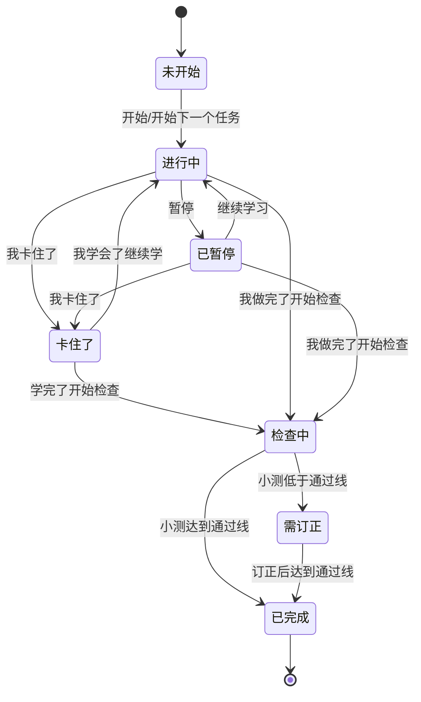

# 孩子端使用方案、按钮联动与联调测试

## 1. 页面目标

孩子端只做一件事：让孩子按顺序完成当天任务，不跳任务、不漏检查、不把卡住问题藏起来。

页面分为三块：

- 顶部进度区：显示 `已完成 / 今日总任务数`，以及一个主按钮。
- 左侧今日任务区：每张任务卡展示任务、状态、计时、完成标准和操作按钮。
- 右侧检查/辅导区：显示小测题、批改结果、订正项和卡住后的辅导步骤。

## 2. 孩子推荐使用流程

### 正常学习

1. 打开孩子端。
2. 看顶部主按钮：系统会自动告诉孩子现在该做什么。
3. 点 `开始下一个任务` 或任务卡里的 `开始`。
4. 任务进入 `进行中`，计时开始。
5. 学完后点 `我做完了，开始检查`。
6. 右侧出现小测，孩子作答后点 `提交小测`。
7. 小测达到通过线后任务变成 `已完成`，进度增加。
8. 再点顶部主按钮进入下一个任务。

### 中途暂停

1. 任务进行中时点 `暂停`。
2. 计时停止，任务状态变成 `已暂停`。
3. 回来后点 `继续学习` 或顶部 `继续当前任务`。
4. 计时从已有时长继续累计，不从 0 开始。

### 学习卡住

1. 任务进行中、暂停或已卡住时点 `我卡住了`。
2. 填一句具体问题，例如：`不会读 library`、`这一步怎么算不出来`。
3. 右侧显示直接解决步骤。
4. 如果学会但还没学完，点 `我学会了，继续学`。
5. 如果已经学完，点 `学完了，开始检查`。
6. 如果还是不会，可以再次点 `我卡住了`，重新描述问题。

### 小测没通过

1. 提交小测后，如果低于通过线，任务状态变成 `需订正`。
2. 顶部按钮变成 `先订正当前小测`。
3. 右侧展示错题、孩子答案、订正答案和下一步动作。
4. 孩子订正后点 `订正后重新检查` 或顶部 `先订正当前小测`。
5. 重新提交，达到通过线后才进入下一个任务。

## 3. 按钮联动关系

### 顶部主按钮

顶部主按钮永远只指向当前最重要的一步，优先级如下：

| 当前状态 | 顶部按钮显示 | 点击结果 |
| --- | --- | --- |
| 有任务 `检查中` | `继续当前检查` | 打开右侧小测，不重新开始任务 |
| 有任务 `需订正` | `先订正当前小测` | 打开错题/小测，不进入下一个任务 |
| 有任务 `卡住了` | `先处理卡住任务` | 聚焦卡住任务，不跳过 |
| 有任务 `进行中` | `继续当前任务` | 聚焦当前任务，不重复计时 |
| 有任务 `已暂停` | `继续当前任务` | 恢复计时，继续学习 |
| 没有阻塞且有未开始任务 | `开始下一个任务` | 启动第一张未开始任务卡 |
| 全部完成 | `生成今日总结` | 生成当天总结 |

### 任务卡按钮

| 按钮 | 可点条件 | 点击结果 | 防误触规则 |
| --- | --- | --- | --- |
| `开始` | 当前没有阻塞任务，且这张卡是第一张未开始任务 | 状态变 `进行中`，计时开始 | 后面的任务显示 `先完成当前` 并禁用 |
| `继续学习` | 这张卡是当前暂停任务 | 状态变 `进行中`，计时继续 | 不能越过检查/订正/卡住任务 |
| `我学会了，继续学` | 这张卡是当前卡住任务 | 状态变 `进行中`，计时继续 | 只恢复当前卡住任务 |
| `暂停` | 任务正在进行中 | 状态变 `已暂停`，计时停止 | 非进行中任务禁用 |
| `我做完了，开始检查` | 当前任务已开始且没有更高优先级阻塞 | 状态变 `检查中`，右侧出小测 | 未开始任务禁用 |
| `继续检查` | 当前任务检查中 | 打开右侧小测 | 不重复写完成事件 |
| `订正后重新检查` | 当前任务需订正 | 打开右侧小测/错题 | 不进入下一任务 |
| `我卡住了` | 当前任务进行中、暂停或卡住 | 记录卡点，右侧给辅导 | 未开始、检查中、已完成禁用 |
| `提交小测` | 小测表单已打开 | 批改并更新任务状态 | 提交中禁用，防重复提交 |

## 4. 通过线和进入下一任务规则

- 当前默认通过线是管理端配置的 `80%`。
- 不是必须全部答对。
- 达到通过线：任务 `已完成`，可以进入下一个任务。
- 未达到通过线：任务 `需订正`，必须先订正当前小测。
- 顶部按钮和任务卡按钮都会阻止孩子跳过 `检查中`、`需订正`、`卡住了`、`进行中/已暂停` 的当前任务。

## 5. 状态机

## 6. 联调测试用例

### P0 主链路

| 编号 | 场景 | 前置 | 操作 | 期望 |
| --- | --- | --- | --- | --- |
| C-P0-01 | 打开孩子端 | 今天有 3 个任务 | 访问 `/child` | 显示进度、任务卡、右侧检查区、顶部主按钮 |
| C-P0-01A | 后端发布到孩子端可见 | 管理端/后端新增任务源 | 调用生成今日任务，孩子端刷新 | 孩子端能看到新发布任务，状态为未开始 |
| C-P0-02 | 开始第一个任务 | 所有任务未开始 | 点顶部 `开始下一个任务` | 第一张任务变 `进行中`，计时运行，其他任务不能提前开始 |
| C-P0-03 | 暂停与继续 | 第一个任务进行中 | 点 `暂停`，再点 `继续学习` | 计时停止后继续累计，不归零 |
| C-P0-04 | 完成后检查 | 第一个任务进行中/暂停 | 点 `我做完了，开始检查` | 状态变 `检查中`，右侧出现小测 |
| C-P0-05 | 检查中防跳过 | 第一个任务检查中 | 点顶部按钮、点第二任务开始 | 只打开当前小测，第二任务不能开始 |
| C-P0-06 | 低分需订正 | 小测答错 | 提交小测 | 状态变 `需订正`，右侧显示错题，不能进入下一任务 |
| C-P0-07 | 订正后通过 | 当前需订正 | 用正确答案提交 | 状态变 `已完成`，进度 +1，可开始下一个任务 |
| C-P0-08 | 下一个任务启动 | 第一任务已完成 | 点顶部按钮 | 第二任务变 `进行中` |

### P0 卡住链路

| 编号 | 场景 | 前置 | 操作 | 期望 |
| --- | --- | --- | --- | --- |
| C-P0-09 | 卡住求助 | 当前任务进行中 | 点 `我卡住了` 并输入问题 | 状态变 `卡住了`，计时停止，右侧显示解决步骤 |
| C-P0-10 | 学会继续 | 当前任务卡住 | 点 `我学会了，继续学` | 状态变 `进行中`，计时继续 |
| C-P0-11 | 卡住后直接检查 | 当前任务卡住但已学完 | 点 `学完了，开始检查` | 状态变 `检查中`，右侧出现小测 |
| C-P0-12 | 反复卡住 | 当前任务卡住 | 再次点 `我卡住了` 输入更具体问题 | 只更新当前任务辅导，不影响其他任务 |

### P1 防重复/防误触

| 编号 | 场景 | 操作 | 期望 |
| --- | --- | --- | --- |
| C-P1-01 | 开始连点 | 连续点开始 | 只记录一次有效开始，不重复计时段 |
| C-P1-02 | 完成连点 | 连续点 `我做完了，开始检查` | 只进入一次检查，不重复写完成事件 |
| C-P1-03 | 小测连交 | 连续点 `提交小测` | 提交中按钮禁用，已完成后返回最近结果 |
| C-P1-04 | 未开始检查 | 未开始任务点检查 | 按钮禁用，不能跳过学习 |
| C-P1-05 | 直接 API 绕过 | 当前有检查/订正任务时 POST 启动其他任务 | 返回 `blocked=true`，其他任务不启动 |

### P1 页面恢复

| 编号 | 场景 | 操作 | 期望 |
| --- | --- | --- | --- |
| C-P1-06 | 刷新检查中页面 | 任务检查中时刷新 `/child` | 自动恢复当前小测入口 |
| C-P1-07 | 刷新需订正页面 | 小测未通过后刷新 `/child` | 顶部仍显示 `先订正当前小测` |
| C-P1-08 | 刷新卡住页面 | 任务卡住后刷新 `/child` | 卡住任务仍优先，不能开始下一任务 |

## 7. 自动化验证入口

- `python .\scripts\child_flow_integration_test.py`：孩子端专项状态机联调，覆盖“后端发布任务 → 孩子端可见 → 开始 → 卡住 → 继续 → 检查 → 订正 → 完成 → 推进任务源进度”。
- `python .\scripts\ui_click_test.py`：真实浏览器点击主链路。
- `python .\scripts\self_test.py`：接口、页面静态和核心业务回归。
- `python .\scripts\validate_agent_core_cases.py`：Agent 核心 53 个用例。
