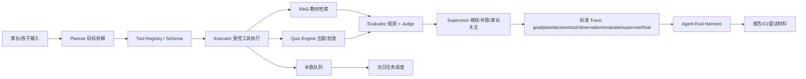

# 受控学习 Agent 架构图

## 面试定位
- 不是吹成全自主 Agent，而是儿童学习场景下更安全的“受控自主 Agent”。
- 核心价值是把学习目标、教材证据、小测结果、补救任务和评测报告闭环起来。
- 适合 AI 测试开发岗位讲：Agent 轨迹评测、RAG 召回、出题泄露、安全红队、回归趋势。

## 当前评测摘要
- `demo_agent`：case `24`，通过率 `1.0`，意外失败 `[]`。
- `learning_agent`：case `219`，通过率 `0.963`，意外失败 `[]`。
- 9.5 质量门禁：`10.0`。
